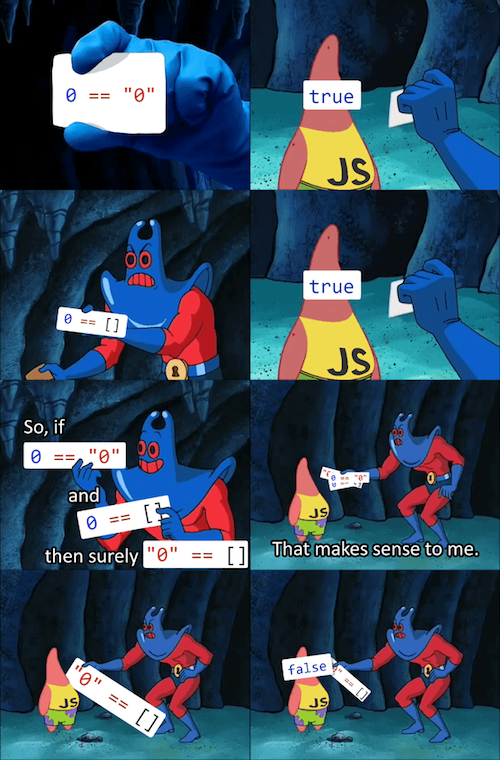
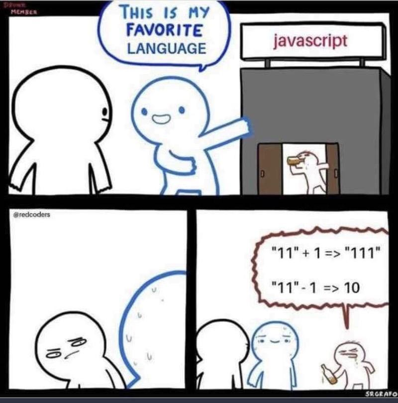
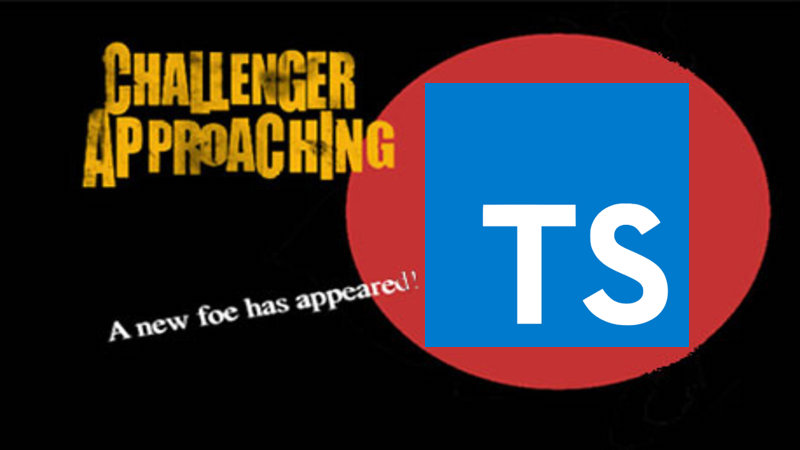

# Introduction to TypeScript

## Overview
This is a lesson plan to teach TypeScript to someone new but familiar with JavaScript.  After the lesson, students will have a basic understanding of what TypeScript is, why it's used, and be able to set up a simple app using TypeScript on their own.

<hr />


## Instructor Action: JavaScript Recap
Briefly ask students to recap uses for JavaScript (create interactive pages, send/receive server data, dynamic rendering, etc).

### JavaScript: The Weird Parts
There is of course a book on this, but it would be fun to briefly go over some unusual behaviors that JavaScript can encounter when using it, and such an article exists for guidance: https://medium.com/@daffl/javascript-the-weird-parts-8ff3da55798e

Feel free to include fun JS memes in the presentation to make it interesting!




Wouldn't it be great if we had something to help us avoid some of the craziness of code?

## Instructor Action: Google Fu!
Ask students to take a couple minutes to Google "strongly typed" and "weakly typed" programming languages and review their findings

A strongly typed programming language refers to use of programming language types in order to both capture invariants of the code, and ensure its correctness, and definitely exclude certain classes of programming errors. Thus there are many "strong typing" disciplines used to achieve these goals.  Weakly typed languages simply don't have those rules.

Discuss advantages and disadvantages to either (for instance, strongly typed can help prevent errors but weakly typed offer better performance).

Ask: Is JavaScript considered a strongly or weakly typed language?  
Follow-up: Is there a way to make it strongly typed?

## Challenger Approaching! (Introduce TypeScript)  


Enter TypeScript!  More friend than foe, TypeScript is a way to introduce strongly typed programming with our old friend, JavaScript. We call it a "typed superset" because it's built upon JavaScript and compiles into JavaScript but it's key feature is to provide static type-checking to help us avoid errors.

### Instructor Action: Environment Setup
- Make sure everyone has Node working on their machine `node -v`
- From there, have students install TypeScript `npm install -g typescript`
- Check to make sure it worked `tsc -v`
- Get ready to rumble!

# First Exercise, Let's Begin!

- Have students create a folder for the exercise, we'll just call it "typescript-exercise".
- In the folder, create a file called "sos.ts".
- Within the file have them declare a variable called "message" and set it equal to "Help me!" and console log it as follows.

```
let message = "Help me!";
console.log(message);
```

- Open up a terminal window and run `node sos.ts` to ensure the output is correct.
- Next, let's have TypeScript
