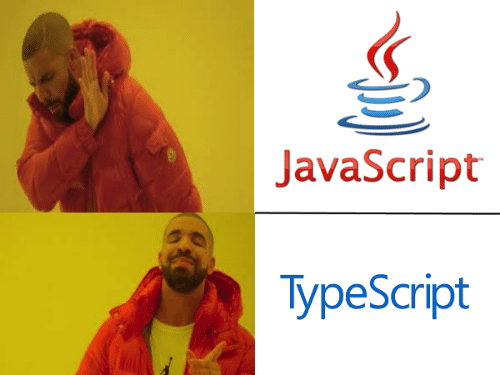

# Introduction to TypeScript

## Overview
This is a lesson plan to teach TypeScript to someone new but familiar with JavaScript.  After the lesson, students will have a basic understanding of what TypeScript is, why it's used, and be able to set it up and use it for a project of their own.

<hr />


## 1. Instructor Action: JavaScript Recap
Briefly ask students to recap uses for JavaScript (create interactive pages, send/receive server data, dynamic rendering, etc).

### JavaScript: The Weird Parts
There is of course a book on this, but it would be fun to briefly go over some unusual behaviors that JavaScript can encounter when using it, and such an article exists for guidance: https://medium.com/@daffl/javascript-the-weird-parts-8ff3da55798e

Feel free to include fun JS memes in the presentation to make it interesting!


Wouldn't it be great if we had something to help us avoid some of the craziness of code?

## 2. Instructor Action: Google Fu!
Ask students to take a couple minutes to Google "strongly typed" and "weakly typed" programming languages and review their findings

A strongly typed programming language refers to use of programming language types in order to both capture invariants of the code, and ensure its correctness, and definitely exclude certain classes of programming errors. Thus there are many "strong typing" disciplines used to achieve these goals.  Weakly typed languages simply don't have those rules.

Discuss advantages and disadvantages to either (for instance, strongly typed can help prevent errors but weakly typed offer better performance).

Ask: Is JavaScript considered a strongly or weakly typed language?  
Follow-up: Is there a way to make it strongly typed?

## 3. Challenger Approaching! (Introduce TypeScript)  


Enter TypeScript!  More friend than foe, TypeScript is a way to introduce strongly typed programming with our old friend, JavaScript. We call it a "typed superset" because it's built upon JavaScript and compiles into JavaScript but it's key feature is to provide static type-checking to help us avoid errors.

### Instructor Action: Environment Setup
- Make sure everyone has Node working on their machine `node -v`
- From there, have students install TypeScript `npm install -g typescript`
- Check to make sure it worked `tsc -v`
- Get ready to rumble!

## 4. How TypeScript Works


- Have students create a folder for the exercise, we'll just call it "typescript-exercise".
- In the folder, create a file called "sos.ts".
- Within the file have them declare a variable called "message" and set it equal to "Help me!" and console log it as follows.

```
let message = "Help me!";
console.log(message);
```

- Open up a terminal window and run `node sos.ts` to ensure the output is correct.
- Next, let's have TypeScript compile our .ts file into a .js file by running the command `tsc sos.ts`.
- Check to make sure a .js file was added to the folder.

Pretty cool, right? But manually recompiling our code would take too long, let's teach the computer to do it for us.

- In the command line, run the command `tsc sos --watch`.
  - This should show a message in the terminal notifying you that the TypeScript compiler is watching the sos.ts file for errors.
- Try to create an error in your code to see it in action!
- Now try changing your message in the sos.ts file, save, and check the sos.js file to see the changes updated automatically.

## 5. You're Just my Type...of Variable - Variable Types in TypeScript

With TypeScript we can assign a type to a variable like so:

```
let messageReceived: boolean = true;
let miles: number = 40;
let destination: string = "Anywhere!";
```
We can even use template literals with our strings to embed other variables like so:

```
let messageTwo: string = `I'm only ${miles} away on an island! Come at once!`;
```

Try outputting a second message to the console that contains one of the previously defined variables.

### 5.1 Array Types
TypeScript offers many ways of declaring arrays. If you want to declare an array, simply add `[]` after number like so:
```
let array: number[] = [6, 7, 8];
```
You can do this with the other types as well, such as strings or booleans, or even mix types.

```
let shipsLog: [name, number] = ['The Captain', 47];
```
Just make sure that each part of the array matches the type in its position or you'll get an error.

### Multiple Types
If you ever need a variable to have multiple types, TypeScript has you covered! When assigning the types, use the `|` operator like so:

```
let hybrid: string | boolean;
hybrid = "I'm thirsty, get me off this island!";
hybrid = false
```

## 6. Cool. What's the Point?

Now that we can assign types to our variables, we can use those types to help prevent errors in our code and help us code more efficiently.

### 6.1 Error checking
Continuing with the example, try to set miles as true like so and call on a student to share what they found:

```
miles = true;
```

Since we've already told TypeScript that our miles variable has to be a number, when we try to set it as true, it gives us an error to let us know our mistake.

Assigning types gives us access to another cool ability as well, and that's called IntelliSense.

### 6.2 IntelliSense

IntelliSense helps by providing us methods that pertain to the declared type for that variable.  
- In the sample code, add a period after each of your variables below their declaration like so:

```
message.
```

IntelliSense has lots of handy methods available.  Call a student up to help and let's try to get our point across and let our message recipients know we're serious by having the message output in all capital letters.  When you think you've got it, have it printed out to the console to check.

```
console.log(message.toUpperCase());
```

### 6.3 Ok, But What if I don't Know the Type?
There are going to be times where you may not know what type of input you're going to get.  TypeScript gives us two methods to address this:

- Any
  - the "any" type allows for the variable to have any type.  Issues can arise because you could declare assign your miles variable in the example a string method if its type is any, and TypeScript wouldn't catch the error.
- Unknown
  - to help solve the problem the "any" type can present, the "unknown" type was created.
  - this gives us a way to accept an input whose type we don't know yet and still exact certain methods on it like so:

```
let miles: unknown = 40;
(miles as string).charAt(1);
```


## Type Inference
Of course, typing is optional in TypeScript, but how we declare our variables can make a big difference.

- Declare a new variable without a type, but don't assign it a value here.
- On the following line, assign a value like so:

```
let mileage;
milage = 100;
```

- Next, declare a variable and assign it a value on the same line, but try to re-assign it on the following line, like so and call on a student to share their findings:

```
let elevation = 5;
elevation = "10 feet";
```

Although we didn't declare a type in either instance, TypeScript was able to infer the type of elevation because we had already assigned it a value.

## Functions
